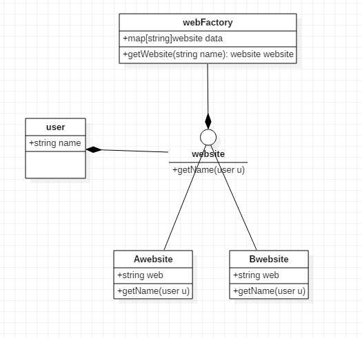

## 享元模式

### 核心思想

​	享元模式通过共享技术实现相同或相似对象的重利用，来解决系统对象数量过多导致的运行代价过高的问题。享元模式将共享的相同内容成为内部状态，将外部环境设置的不能共享的内容称为外部状态，通过设置不同的外部状态使得相同的对象可以具有一些不同的特征，相同的内部状态是可以共享的。

​	享元模式中通常出现工厂模式，需要创建一个享元工厂来负责维护一个享元池，用于存储具有相同内部状态的享元对象。在享元模式中共享的是享元对象的内部状态，外部状态需要通过环境来设置，享元对象一般都设计为较小的对象，它所包含的内部状态较少，这种对象称为细粒度对象，享元模式的目的就是使用共享技术来实现大量细粒度对象的复用。

### 具体实现

#### 代码架构图

​	website:抽象享元接口（内部对象）

​	Awebsite,Bwebsite：具体享元类

​	webFactory:享元类工厂

​	user:用户数据（外部对象）

​	

#### 流程及实践

​	1、创建享元工厂

​	2、创建用户数据

​	3、利用享元工厂调用用户数据返回具体的享元类

​	4、享元类实现功能

##### 享元类及用户接口实现

```
type user struct {
	name string
}
type website interface {
	getName(u user)
}

type Awebsite struct {
	web string
}

type Bwebsite struct {
	web string
}

func (me *Awebsite) getName(u user) {
	fmt.Println("A website ", me.web, ":", u.name)
}

func (me *Bwebsite) getName(u user) {
	fmt.Println("B website ", me.web, ":", u.name)
}

```


##### 享元工厂实现

```
type webFactory struct {
	data map[string]website
}

func(me *webFactory)getWebsite(name string)website{
	if _,ok:=me.data[name];ok{
		return me.data[name]
	}else{
		switch name {
		case "tian":
			return new(Awebsite)
		case "di":
			return new(Bwebsite)
		}
	}
	return new(Bwebsite)
}
```


##### 调用方式

```
func main() {
	use:=user{name:"llla"}
	use1:=user{name:"111"}
	webfac:=new(webFactory)
	web:=webfac.getWebsite("tian")
	web.getName(use)
	web.getName(use1)
	return
}
```


​	上述代码，如果想调用具体接口，只需要添加外部数据就行了，减少了对象的数量。


##### 享元模式的意义

​	享元模式的主要优点是它可以极大地减少内存中的对象的数量，使得相同对象或相似对象在内存中只保存一份，缺点是使得系统更加复杂，并且需要将享元对象的状态外部化，而读取外部状态使得运行时间变长。


​	


