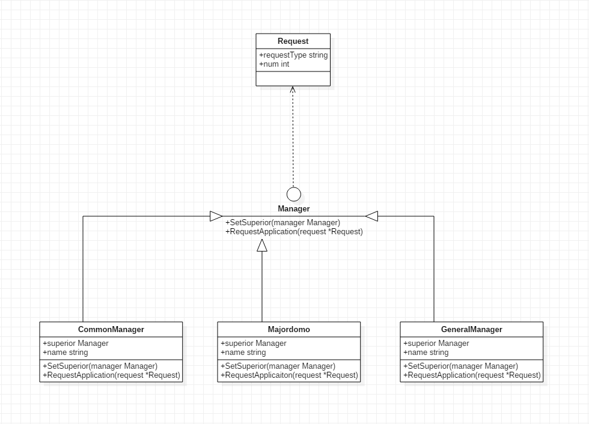

## 职责链模式

### 核心思想

​	职责链可以是一条直线，一个环或者一个树形结构，最常见的职责链就是直线型，即沿着一条单向的链来传递请求，链上的每一个对象都是请求处理者，职责链模式可以将请求的处理者组织成一条链，并让请求沿着链传递，由链上的处理者对请求进行相应的处理，客户端无需关注请求的处理细节以及请求的传递，只需将请求发送到链上即可，实现请求发送者和请求处理者的解耦。

​	主要意义：避免发送者和接收者耦合到一起，让多个对象都有可能接受请求，将这些对象连成一条链，并且沿着这条链进行传递请求，直到有对象处理它为止，职责链模式是一种对象行为模式。


### 具体实现

#### 代码架构图



#### 流程及实践

##### 大概流程：

​	1、申请各种管理者对象

​	2、管理者对象设置上级

​	3、申请请求对象

​	4、初级管理者对象调用请求对象

##### 处理者接口设计：

```
type Request struct {
	requestType string
	num         int
}

type Manager interface {
	SetSuperior(manager Manager)
	RequestApplication(request *Request)
}

type CommonManager struct {
	superior Manager
	name     string
}

type Majordomo struct {
	superior Manager
	name     string
}

type GeneralManager struct {
	superior Manager
	name     string
}

func (me *CommonManager) SetSuperior(manager Manager) {
	me.superior = manager
}

func (me *CommonManager) RequestApplication(request *Request) {
	if request.requestType == "请假" && request.num < 3 {
		fmt.Println(me.name, ":", request.requestType, ",", request.num)
	} else {
		if me.superior != nil {
			me.superior.RequestApplication(request)
		} else {
			fmt.Println("权力之外的申请，禁止申请")
		}
	}
}

func (me *Majordomo) SetSuperior(manager Manager) {
	me.superior = manager
}
func (me *Majordomo) RequestApplication(request *Request) {
	if request.requestType == "请假" {
		fmt.Println(me.name, ":", request.requestType, ",", request.num)
	} else if request.requestType == "涨薪" {
		if request.num < 1000 {
			fmt.Println(me.name, ":", request.requestType, ",", request.num)
		} else {
			if me.superior != nil {
				me.superior.RequestApplication(request)
			} else {
				fmt.Println("权力之外的申请，禁止申请")
			}
		}
	}
}

func (me *GeneralManager) SetSuperior(manager Manager) {
	me.superior = manager
}
func (me *GeneralManager) RequestApplication(request *Request) {
	if request.requestType == "请假" && request.num < 10 {
		fmt.Println(me.name, ":", request.requestType, ",", request.num)
	} else if request.requestType == "涨薪" && request.num < 5000 {
		fmt.Println(me.name, ":", request.requestType, ",", request.num)
	} else {
		fmt.Println("权力之外的申请，禁止申请")
	}
}

```

##### 调用流程

```
func main() {
	commonManager := &CommonManager{
		name: "manager",
	}
	major := &Majordomo{
		name: "major",
	}
	general := &GeneralManager{
		name: "general",
	}
	commonManager.SetSuperior(major)
	major.SetSuperior(general)

	req:=&Request{
		requestType:"涨薪",
		num:3000,
	}

	commonManager.RequestApplication(req)

}
```


##### 职责链模式的意义

​	职责链模式的意义就是使得一个对象无需知道是哪一个对象处理其请求，该对象仅需知道该请求的入口即可，不需要清楚整个链的结构，就可以获取结果。