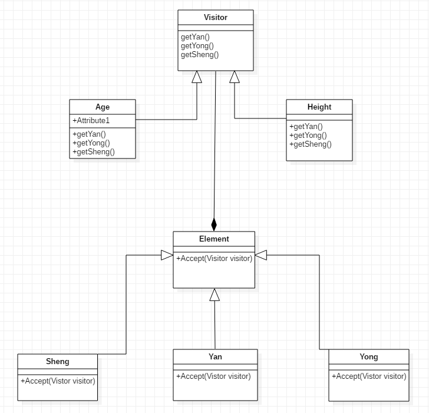

访问者模式

### 核心思想

​	访问者模式主要目的是将算法操作与对象结构分离的软件设计模式。表示一个作用于某对象结构中的各元素的操作，它可以使你再不改变各元素的类的前提下定义作用于这些元素的新操作。

​	基本想法：首先我们拥有实现一个公共接口的多个元素，每个元素都拥有一个accept方法来接受访问者对象，访问者是一个实现访问者接口的对象，他拥有一个visit方法，这个方法对访问到的对象结构中不同类型的元素做出不同的反应。所以如果想增加新操作，只要增加新操作的访问者（实现visit方法的接口），不改变代码原有结构就可以了。

### 具体实现

	#### 代码架构图



#### 流程及实践

##### 		大概流程：

​	1、创建一个具体类型的元素

​	2、创建一个访问者

​	3、将访问者载入元素的方法参数中

​	4、根据具体的元素调用访问者中具体的方法

##### 		接口的设计：

##### 		访问者设计：

​		访问者接口包括三个方法,getYan() int,getYong() int,getSheng() int。例子中两个结构体实现了这个结构，一个是获取年龄，一个是获取体重。		

```
type Visitor interface {
	getYan() int
	getYong() int
	getSheng() int
}

type Age struct {
}

type Height struct {
}

func (me *Age) getYan() int {
	return 16
}
func (me *Age) getYong() int {
	return 20
}
func (me *Age) getSheng() int {
	return 22
}

func (me *Height) getYan() int {
	return 130
}
func (me *Height) getYong() int {
	return 140
}
func (me *Height) getSheng() int {
	return 150
}
```

	##### 		元素设计：

​		元素设计为一个包含Accept(visitor Visitor)方法的接口，具体的元素只需要实现这个接口就好，本例子中三个结构体分别实现了此接口。

```
type Element interface {
	Accept(visitor Visitor)
}

type Yan struct {
}
type Yong struct {
}
type Sheng struct {
}

func (me *Yan) Accept(visitor Visitor) {
	fmt.Println(visitor.getYan())
}

func (me *Yong) Accept(visitor Visitor) {
	fmt.Println(visitor.getYong())
}

func (me *Sheng) Accept(visitor Visitor) {
	fmt.Println(visitor.getSheng())
}

```

##### 		调用方式：

```
func main() {
	height:=new(Height)
	element:=new(Yan)
	element.Accept(height)
	return
}

```

​	上述代码介绍我们可以看出，访问者目前具有的功能主要有获取年龄，获取体重两个方法，如果需要添加新的功能操作的话，例如获取家庭年收入，只需要添加一个实现Visitor接口的结构体就好，不改变原有的代码结构，对元素设计更是没影响。

##### 		访问者模式的意义：

​		访问者模式的目的就是把数据结构和作用于结构之上的操作之间的耦合解脱开，使得操作结合可以相对自由地演化。如果一个系统有着比较稳定的数据结构，又有易于变化的算法的话，使用访问者模式就是比较合适的，因为访问者模式使得算法操作的增加变得更容易，但是访问者模式的缺点也就是使得增加新的数据结构变得更加困难了，假如说想获取除了Yan,Yong,Sheng三个人意外的信息，这样子就需要在visitor结构体新添方法，而且，元素这边也需要实现新的结构体。


#### 代码

上述代码均位于designer_patterns_go_code中。

